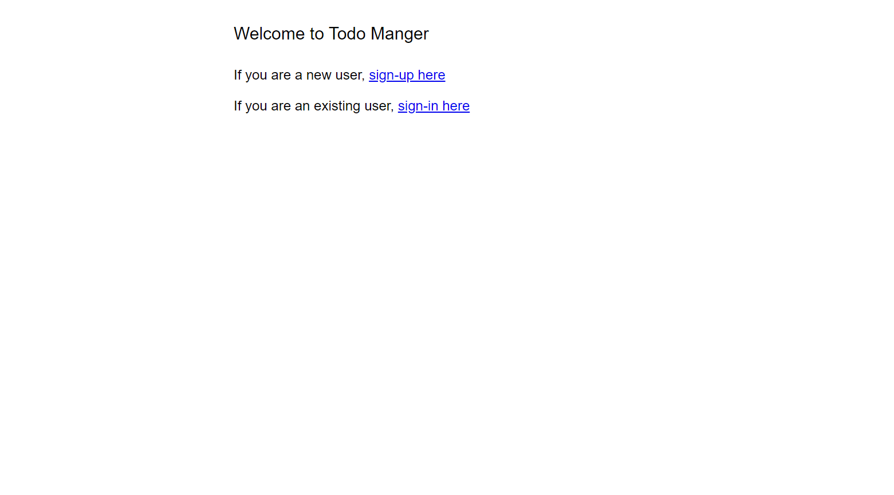
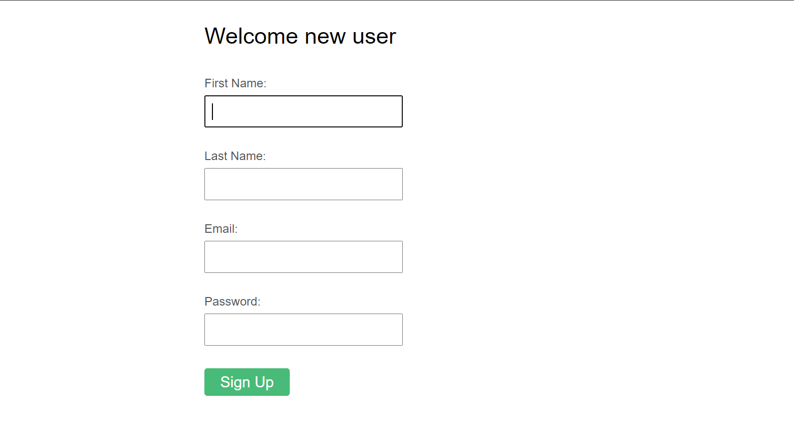
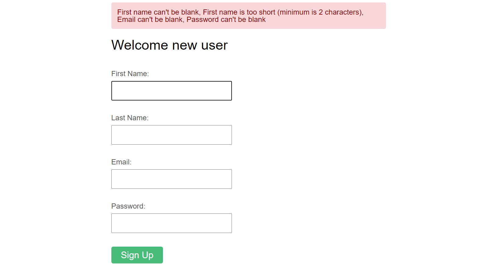
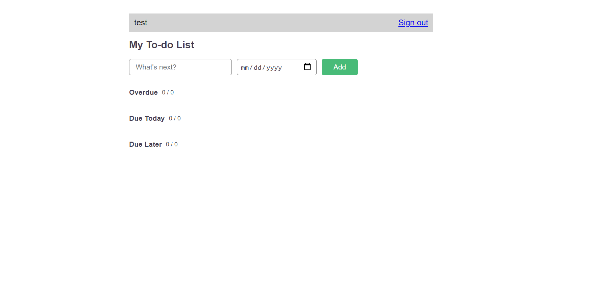
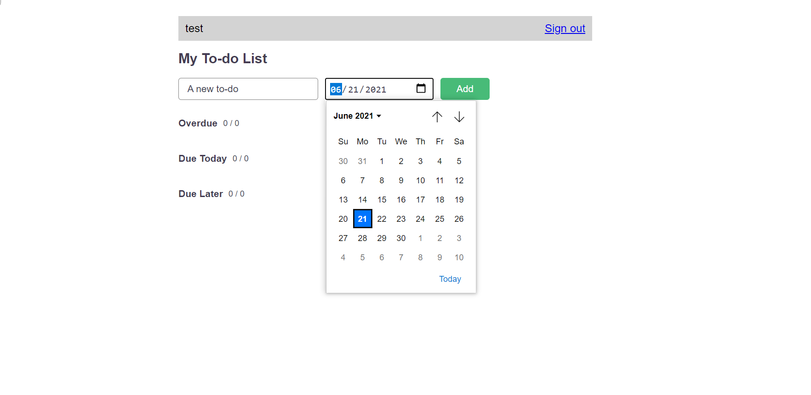
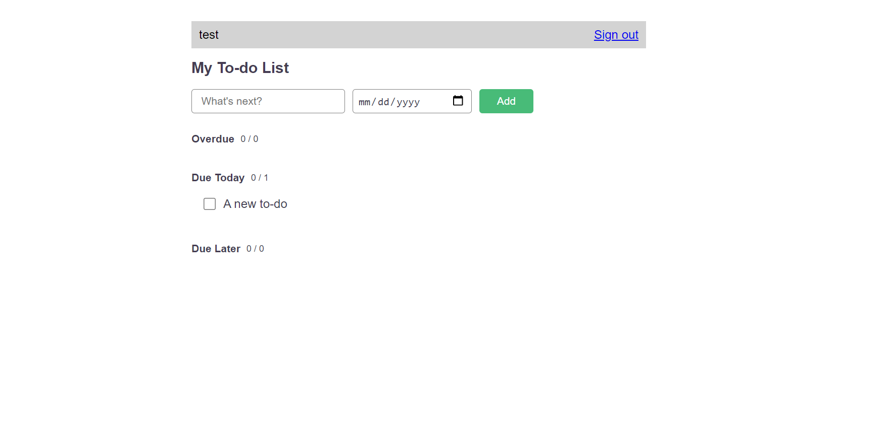
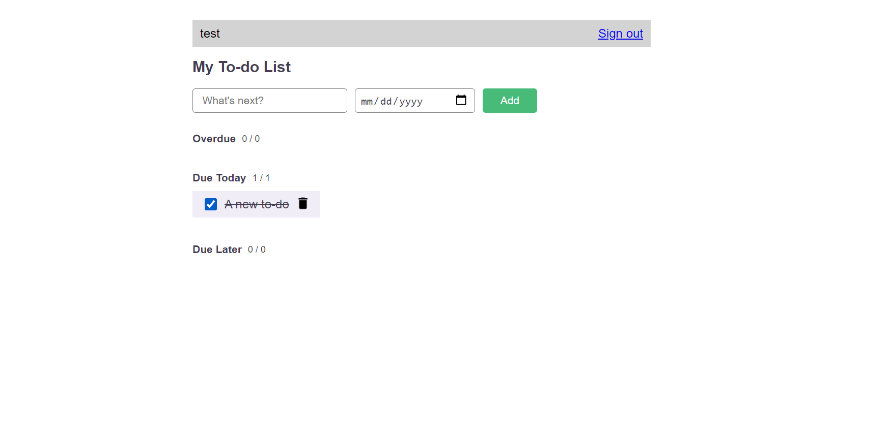
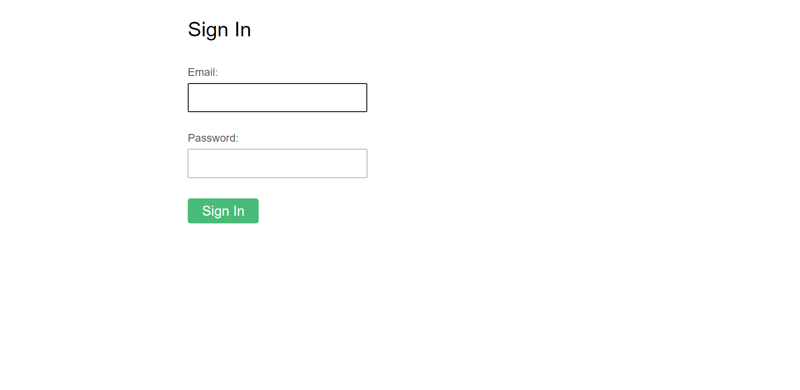

# Todo Manager

Go and look around this website [Todo Manager](https://karthick-todo-manager-saas-201.herokuapp.com/) demo user (email: 'test@gmail.com' and password: 'test')

### Home Page

If you are not logged in it will redirect to home page

### Sign Up page

You should create new session if you are a new user

First name, Email and Password is must. Last name is optional.
Email should be unique you can't create two users with same email.
If you missed anything from the above, then it will flash errors

### To-do Page

You will redirect to this page if you were successfuly logged in

Now you can add todos.

Todo text and Due date is must.

You can tick the checkbox as completed and you can also delete the todo by clicking the transhcan icon

You can sign out from this session by clickin on the text right from the user name

### Sign In Page

If you were signed out, you will redirect to the home page. In this home, you choose Sign in option.

Email and Password is required if you missed it, then it will flash an error.
